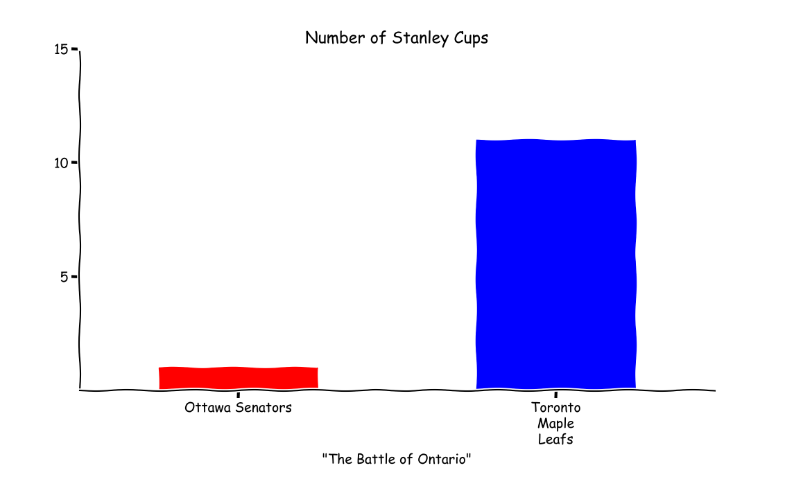

## Project Portfolio

---
[Stanley Cup Champions 1927-2019: Exploratory Data Analysis](/Notebooks/Stanley_Cup_Champions_1927-2019.html)

[Stanley Cup Champions 1927-2019:VBA Webscraper](https://github.com/cwils021/Stanley-Cup-Champs-1927-2019/blob/master/StanleyCupChamp1927_2019_VBAScript.md)

---
[Stanley Cup Champions 1927-2019: Cleaning Webdata with Pandas](https://github.com/cwils021/Stanley-Cup-Champs-1927-2019/blob/master/SCC1927-2019.py)

---

Page template forked from <a href="https://github.com/evanca/quick-portfolio">evanca</a>

<!-- Remove above link if you don't want to attibute -->
